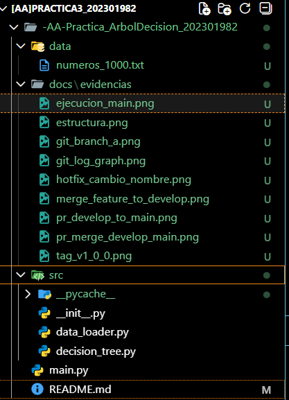
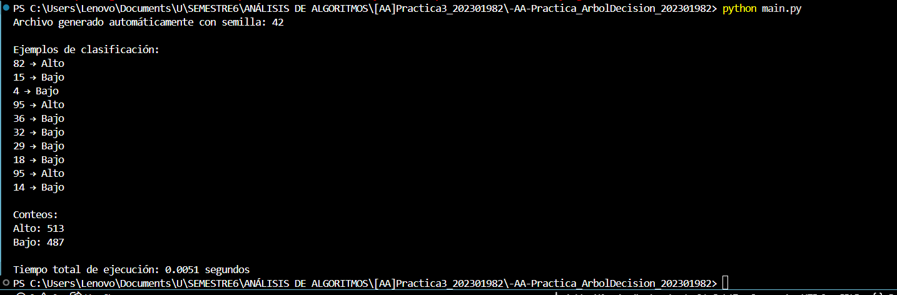
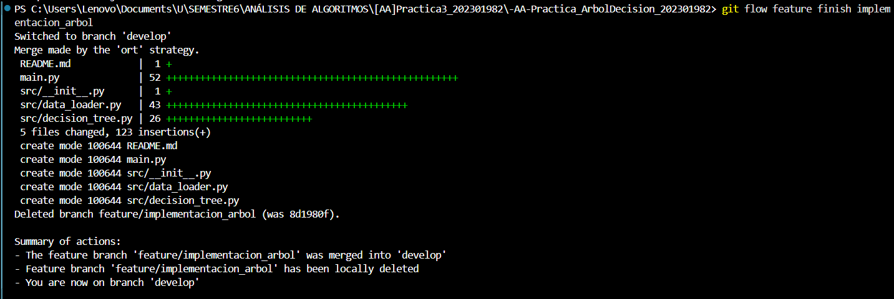
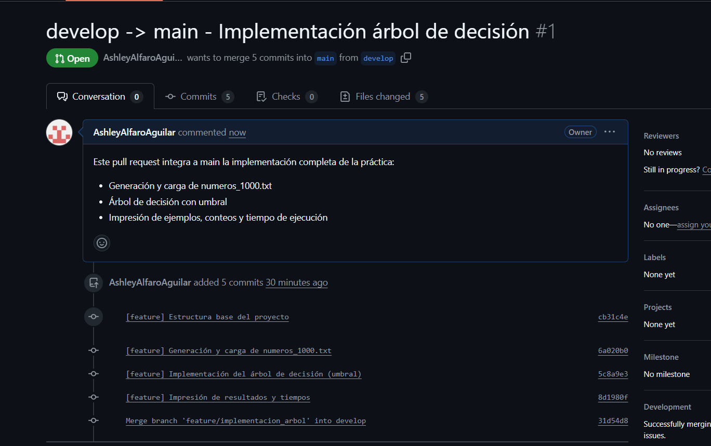
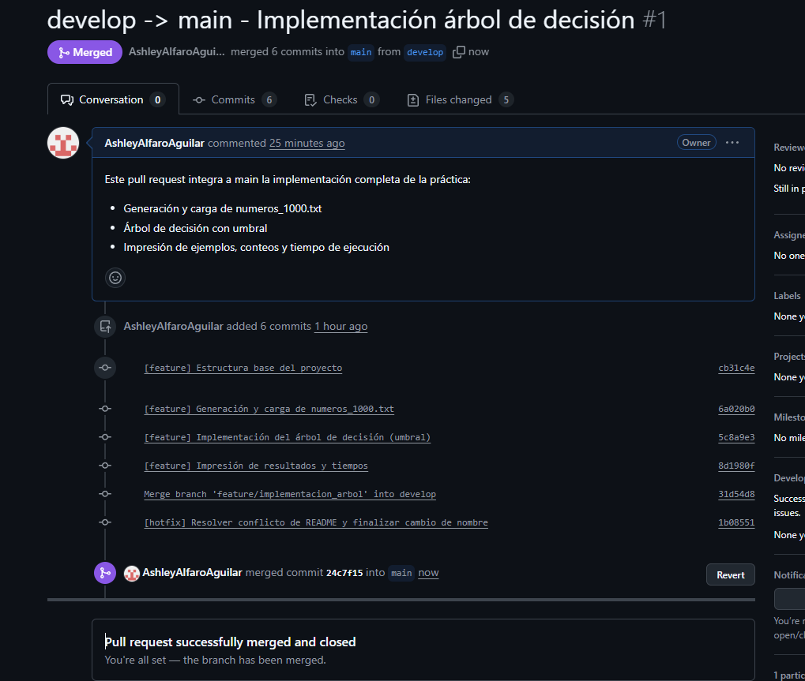
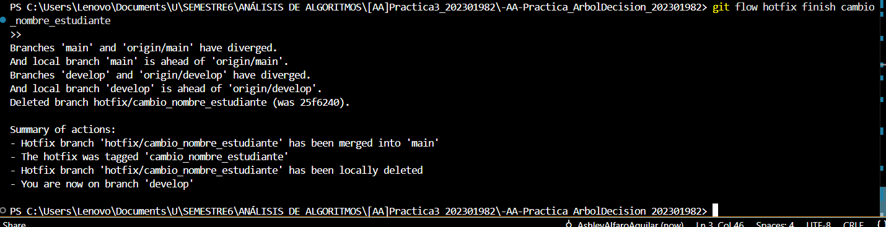
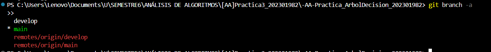
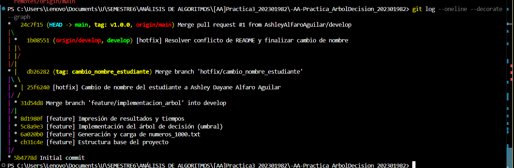
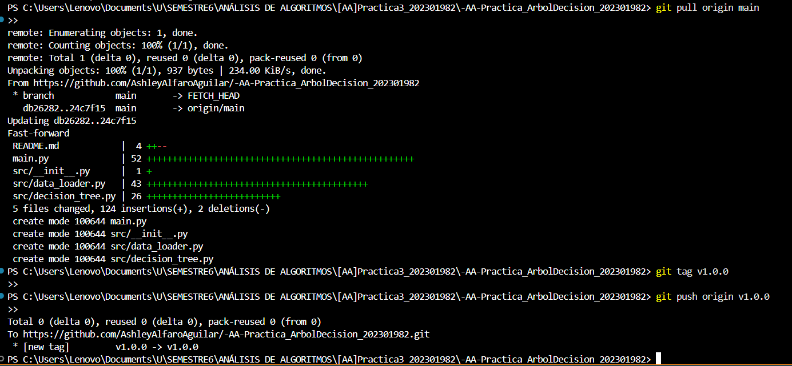

# Práctica 3 - Árbol de Decisión

**Universidad:** Universidad Da Vinci de Guatemala  
**Facultad:** Ingeniería en Sistemas  
**Curso:** Análisis de Algoritmos  
**Práctica:** 3 – Árbol de Decisión  
**Estudiante:** Ashley Dayane Alfaro Aguilar  
**Carnet:** 202301982  
**Fecha:** 19 de noviembre de 2025

---

## Objetivo general

Construir y ejecutar un árbol de decisión simple en Python para clasificar números como “Alto” o “Bajo” a partir de un umbral, aplicando de forma rigurosa el flujo de trabajo Gitflow (ramas, commits, PRs, merges y versionado).

## Objetivos específicos

- Implementar un árbol de decisión minimalista con 1 solo nodo de decisión y 2 hojas (Bajo / Alto).  
- Leer un archivo TXT con 1000 números enteros y clasificarlos según el umbral definido.  
- Generar salidas claras en consola con ejemplos, conteos y tiempo de ejecución.  
- Aplicar Gitflow usando ramas `feature/*` y `hotfix/*`, commits significativos, pull requests y merges hacia `develop` y luego hacia `main`.  

---

## Descripción del árbol de decisión

El árbol de decisión utilizado en esta práctica es simple:

- Tiene un solo nodo de decisión, que compara un número con un umbral.  
- Tiene **dos hojas**:
  - Si `número >= UMBRAL` → se clasifica como **“Alto”**.  
  - Si `número < UMBRAL` → se clasifica como **“Bajo”**.  

El valor por defecto del umbral es:

```python
UMBRAL = 50
```

---

## Metodología

### 1. Lógica del programa

El flujo principal se encuentra en `main.py` e implementa:

1. Inicio del cronómetro.  
2. Verificación y generación del archivo `numeros_1000.txt`.  
3. Carga de números.  
4. Clasificación según umbral.  
5. Impresión de ejemplos, conteos y tiempo.  

### 2. Estructura del proyecto



### 3. Flujo Gitflow aplicado

- git flow init  
- feature/implementacion_arbol  
- hotfix/cambio_nombre_estudiante  
- PR develop → main  
- Tag final: v1.0.0  

---

## Resultados



## Evidencias

Incluye capturas:

- merge feature → develop  



- PR develop → main 




- hotfix finalizado



- git branch -a  



- git log graph  



- tag v1.0.0  




---

## Conclusiones

- Un árbol de decisión simple puede resolver tareas básicas de clasificación.  
- Gitflow facilita el control del desarrollo.  
- La práctica refuerza manejo de archivos, módulos y documentación en Python.